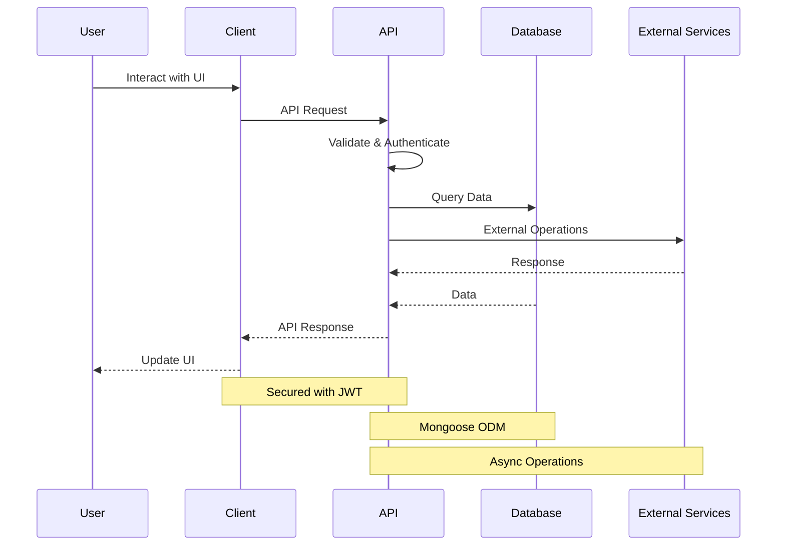
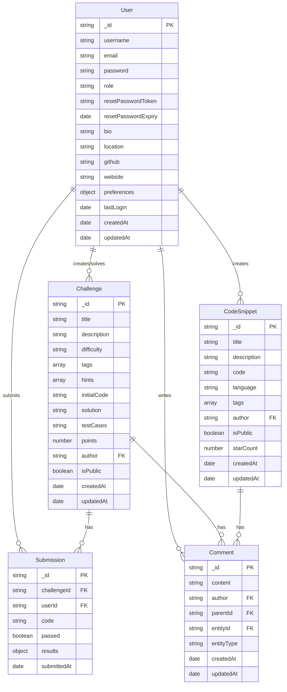

# CodeFR - French Learning Platform for Coding

## 🎯 Project Description

CodeFR is an interactive programming learning platform in French, designed to make coding education accessible to the French-speaking community. Our mission is to break down language barriers in programming education by offering an immersive and enriching experience in French.

### 👥 The Team

Our passionate team consists of developers committed to democratizing code learning:
- Full-Stack Developers
- UX/UI Experts
- Educational Content Specialists
- Community Managers

## 🏗 Architecture and Technologies

### Overall Architecture

```mermaid
graph TB
    subgraph "Client Layer"
        UI[UI Components]
        Router[React Router]
        State[State Management]
        Services[API Services]
        Editor[Monaco Editor]
        
        UI --> Router
        UI --> State
        UI --> Services
        UI --> Editor
    end

    subgraph "API Layer"
        API[Express API]
        Auth[Authentication]
        Valid[Validation]
        Middle[Middleware]
        
        API --> Auth
        API --> Valid
        API --> Middle
    end

    subgraph "Business Layer"
        Controllers[Controllers]
        Services2[Services]
        Utils[Utilities]
        
        Controllers --> Services2
        Services2 --> Utils
    end

    subgraph "Data Layer"
        Models[Mongoose Models]
        MongoDB[(MongoDB)]
        Cache[Redis Cache]
        
        Models --> MongoDB
        Models --> Cache
    end

    subgraph "External Services"
        Email[Email Service]
        Storage[File Storage]
        Execution[Code Execution]
    end

    Client[Web Client] --> UI
    Services --> API
    Middle --> Controllers
    Services2 --> Models
    Controllers --> External Services
```



```
├── Client (React)
│   ├── Components
│   ├── Pages
│   ├── Services
│   ├── Contexts
│   └── Assets
├── Server (Node.js)
│   ├── Routes
│   ├── Models
│   ├── Middleware
│   └── Utils
└── Database (MongoDB)
```

### Technical Stack

#### Frontend
- **React**: Main framework
- **Material-UI**: UI components
- **Monaco Editor**: Code editor
- **Framer Motion**: Animations
- **Axios**: HTTP requests
- **React Router**: Navigation
- **Context API**: State management

### Data Model



#### Backend
- **Node.js**: Runtime
- **Express**: Web framework
- **MongoDB**: Database
- **Mongoose**: ODM
- **JWT**: Authentication
- **Bcrypt**: Encryption
- **Nodemailer**: Email sending

#### Tools and Services
- **Git**: Version control
- **ESLint**: Linting
- **Jest**: Testing
- **MongoDB Atlas**: DB hosting
- **Vercel**: Deployment

## 📈 Development Report

### 🌟 Major Successes

1. **Intuitive User Interface**
   - Modern, responsive design
   - Light/dark theme
   - Smooth navigation
   - Subtle animations

2. **Key Features**
   - Integrated code editor
   - Progressive challenge system
   - Code snippet sharing
   - Community support

3. **Security and Performance**
   - Robust authentication
   - Sensitive data encryption
   - Query optimization
   - Efficient caching

### 🎯 Challenges Faced

1. **Technical**
   - Monaco editor integration
   - WebSocket management
   - Performance optimization
   - Client/server state synchronization

2. **UX/UI**
   - Mobile editor adaptation
   - Visual consistency
   - Accessibility
   - Multilingual support

3. **Functional**
   - Secure code execution
   - Resource management
   - System scalability
   - Content moderation

### 🔄 Areas for Improvement

1. **Performance**
   - Bundle size optimization
   - Systematic lazy loading
   - Advanced caching
   - Server-side rendering

2. **Features**
   - Real-time collaboration mode
   - Support for more languages
   - Badge system
   - Personalized learning paths

3. **Infrastructure**
   - More robust CI/CD
   - Advanced monitoring
   - Automated backup
   - Load balancing

### 📚 Lessons Learned

1. **Technical**
   - Importance of modularity
   - Need for automated testing
   - Value of monitoring
   - Impact of initial architecture

2. **Project**
   - Clear communication
   - Continuous documentation
   - Early user feedback
   - Rapid iterations

3. **UX**
   - Importance of user feedback
   - Value of simplicity
   - Need for accessibility
   - Performance impact

### 🚀 Next Steps

1. **Short Term**
   - Performance improvements
   - Test coverage extension
   - Mobile optimization
   - New community features

2. **Medium Term**
   - Collaborative mode
   - Public API
   - CI/CD integration
   - Gamification system

3. **Long Term**
   - Native mobile apps
   - Full IDE support
   - AI code suggestions
   - Extension marketplace

## 🎓 Conclusion

Developing CodeFR has been an enriching experience that demonstrated the importance of:
- Careful planning
- Scalable architecture
- User feedback
- Continuous documentation
- Rapid iteration

Our vision of making code learning accessible in French is taking shape, with a growing positive impact on the French-speaking community. The challenges we faced have strengthened our expertise and determination to create an increasingly performant solution adapted to user needs.

The next steps for the project are clearly defined, with a focus on continuous improvement and innovation, always guided by feedback from our growing community.

---

*"Code has no borders, but learning deserves to be in our language."* - The CodeFR Team
